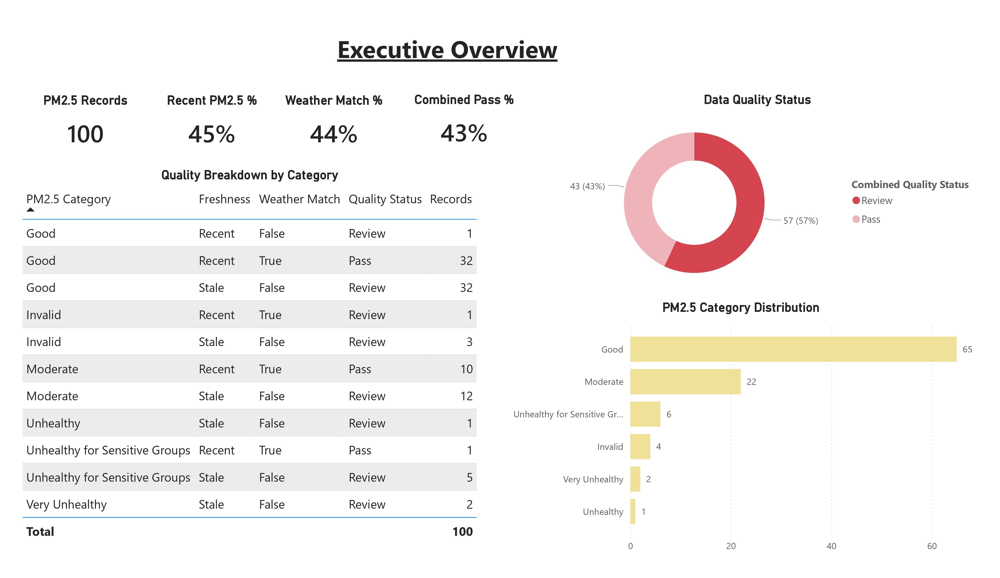
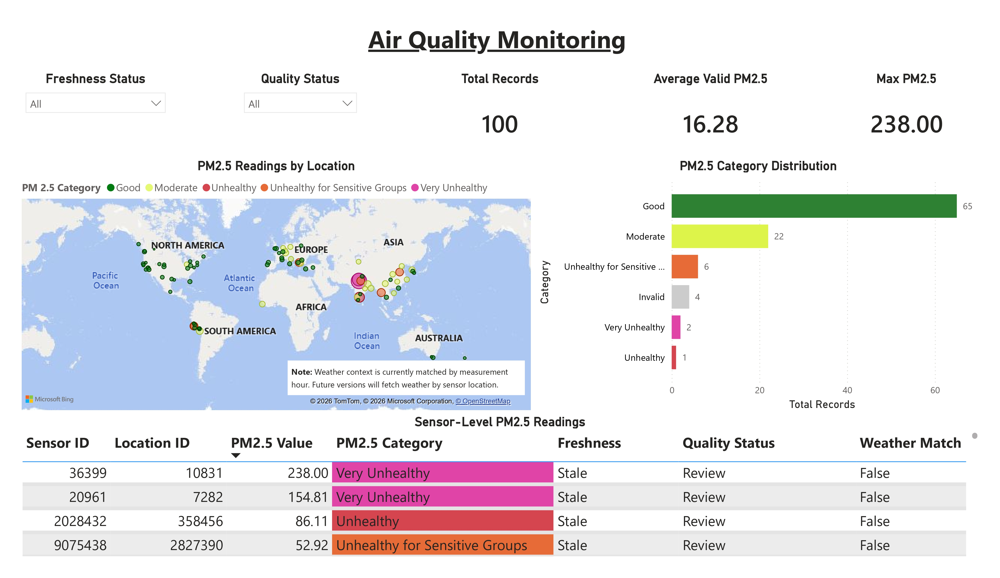
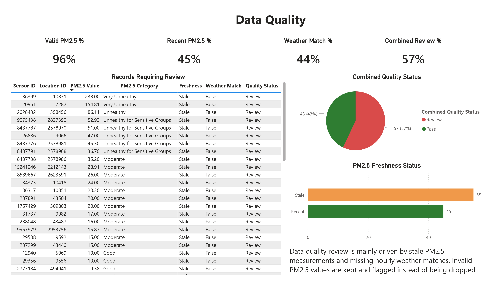

# Air Quality & Weather Analytics Pipeline

A data engineering portfolio project that ingests PM2.5 air quality data from the OpenAQ API, stores raw and processed files, loads data into DuckDB, and builds staging, warehouse, data quality, and dashboard-ready mart tables.

## Project Objective

This project demonstrates an end-to-end analytics pipeline for air quality and weather monitoring. The goal is to help analysts understand PM2.5 levels, weather context, data freshness, measurement quality, and dashboard-ready environmental indicators.

## Architecture

```text
OpenAQ API + Open-Meteo API
  -> Raw JSON files
  -> Processed CSV files
  -> DuckDB staging tables
  -> Cleaned warehouse tables
  -> Data quality summaries
  -> Dashboard marts
```

## Tech Stack

- Python
- OpenAQ API
- Open-Meteo API
- pandas
- DuckDB
- SQL
- python-dotenv
- Power BI-ready mart tables

## Data Layers

| Layer | Object | Purpose |
|---|---|---|
| Raw | `data/raw/*.json` | Store original API responses |
| Processed | `data/processed/*.csv` | Flatten API responses into tabular files |
| Staging | `stg.latest_pm25`, `stg.weather_hourly` | Preserve source-like data in DuckDB |
| Warehouse | `dw.pm25_measurements`, `dw.weather_hourly` | Parse types and add quality flags |
| Data Quality | `dq.pm25_quality_summary`, `dq.pipeline_quality_summary` | Summarize source and pipeline quality checks |
| Mart | `mart.pm25_latest_dashboard`, `mart.pm25_weather_dashboard` | Dashboard-ready PM2.5 and weather tables |

## Key Data Quality Checks

- PM2.5 value must be non-negative
- Measurement timestamp must be recent within 24 hours
- Latitude must be between -90 and 90
- Longitude must be between -180 and 180
- Sensor ID and location ID should not be missing

## Current Pipeline Quality Findings

Based on the latest ingestion run:

| Metric | Result |
|---|---:|
| PM2.5 total rows | 100 |
| Valid PM2.5 value rate | 96% |
| Recent PM2.5 rate | 45% |
| Weather hourly rows | 24 |
| Weather quality rate | 100% |
| Weather match rate | 44% |
| Combined pass rate | 43% |
| Combined review rate | 57% |

## Dashboard Marts

The table `mart.pm25_latest_dashboard` includes:

- PM2.5 value
- PM2.5 category
- Measurement age in hours
- Freshness status
- Data quality status
- Sensor and location IDs
- Latitude and longitude

The table `mart.pm25_weather_dashboard` adds:

- Weather hourly match status
- Temperature
- Relative humidity
- Precipitation
- Wind speed
- Combined PM2.5 and weather quality status

## Dashboard Preview

### Executive Overview



### Air Quality Monitoring



### Data Quality



The Power BI report file is available at:

```text
dashboards/air-quality-weather-dashboard.pbix
```

## How to Run

Create and activate a virtual environment:

```powershell
python -m venv .venv
Set-ExecutionPolicy -Scope Process -ExecutionPolicy Bypass
.\.venv\Scripts\Activate.ps1
pip install -r requirements.txt
```

Create a `.env` file:

```env
OPENAQ_API_KEY=your_api_key_here
```

Run the pipeline:

```powershell
python src\ingest_latest_pm25.py
python src\load_pm25_to_duckdb.py
python src\ingest_openmeteo_weather.py
python src\load_weather_to_duckdb.py
python src\run_sql_file.py sql\01_create_dw_pm25_measurements.sql
python src\run_sql_file.py sql\02_create_dq_pm25_summary.sql
python src\run_sql_file.py sql\03_create_mart_pm25_latest_dashboard.sql
python src\run_sql_file.py sql\04_create_dw_weather_hourly.sql
python src\run_sql_file.py sql\05_create_mart_pm25_weather_dashboard.sql
python src\run_sql_file.py sql\06_create_dq_pipeline_summary.sql
```

## Next Steps

- Fetch weather data dynamically for PM2.5 sensor locations
- Add location names and country metadata
- Add historical PM2.5 and weather trends
- Build Power BI dashboard pages
- Add automated data quality tests
- Add orchestration with Airflow